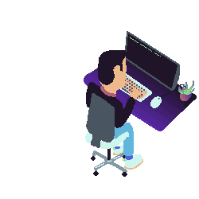

<h2 align="center">

 Hello, my name is Cody and I love to code!  💻 
</h2>

<h3 align="center">
</h3>

<a href="https://www.linkedin.com/in/codingreeves/">Linkedin</a>  -  <a href="https://codingreeves.com/">Portfolio</a>

 
 

---

- 🎓 Began my coding journey with freeCodeCamp.

- 🌱 I’m currently learning Solidity, MERN, and Database technologies.

- 🔭 Currently working on an app to reward drummers for developing a consistent practice routine, and help them explore new ideas on the drumset. 

- 🎮 Continually working on a passion project in Unity called [Gnash](https://github.com/TechnoGecko/MicrobialNightmare).

- 👯 I’m looking to begin collaborating with other people and stop thinking of coding as a lonely task! Open to working on:
    - Open-source
    - Web3 projects
    - That one weird game idea you had!
    - Other ideas? Try me 🤓

- ⚡ Fun facts: I'm a drummer/music lover, I love cooking, and I used to play a lot of video games before I started making them.
